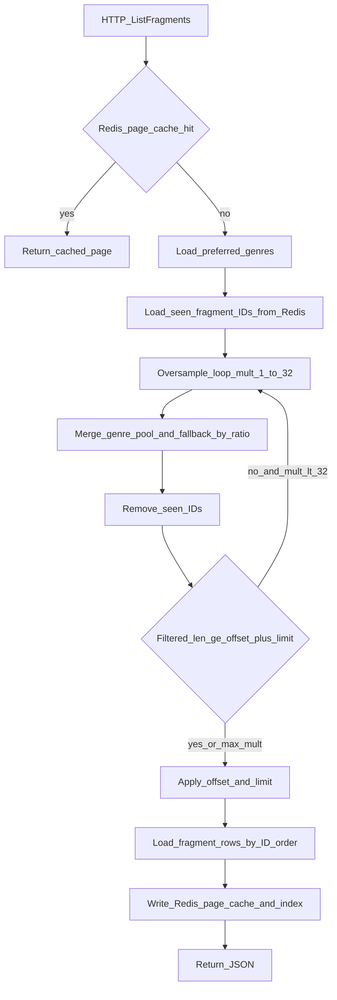
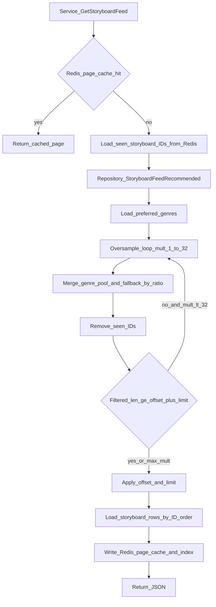

# V1 Recommendation System (MySQL + Redis)

This document describes the current V1 recommendation behavior for feed endpoints.

## Boundaries

- Fragment recommender (`GET /api/v1/fragments?tab=for_you`) only returns fragments.
- Storyboard recommender (`GET /api/v1/storyboards/feed?tab=for_you`) only returns storyboards.
- The two recommenders are independent and never mix entity types.
- `following` tabs remain timeline/follow based and are independent from `for_you`.

## Personalization Signals

`for_you` uses onboarding preferred genres only (`user_settings.preferred_genres_json`). Follow relationships drive the **`following`** tabs, not `for_you`.

No ML model is required in this phase.

## Candidate Pools (`for_you`)

Each recommender builds two pools:

- **Genre match**: public content whose parent story genre is in the user’s preferred genres (empty pool if the user has no preferences).
- **Fallback**: public “hot” content by engagement metrics.

Ratios (when the user has at least one preferred genre):

- fragments: `fragment_genre_ratio`, `fragment_fallback_ratio`
- storyboards: `storyboard_genre_ratio`, `storyboard_fallback_ratio`

If preferred genres are empty, the feed is **fallback-only** (same public ordering as the fallback pool).

`candidate_multiplier` controls the temporary candidate fetch size before final merge/pagination.

## Seen / Already-viewed exclusion (`for_you` only)

For logged-in users, opening a **detail** page records the entity as “seen” so it can be deprioritized out of the personalized merge:

- Storyboard: authenticated `GET /api/v1/storyboards/:id`
- Fragment: authenticated `GET /api/v1/fragments/:id` (optional auth must yield a `userID`)

Storage (Redis sorted sets):

- `reco:for_you_seen:storyboards:{userId}` — member = storyboard ID, score = last viewed time (ms)
- `reco:for_you_seen:fragments:{userId}` — member = fragment ID, score = last viewed time (ms)

Configuration (`recommendation` in app config / env):

- `seen_max_entries` (default 5000, env `RECO_SEEN_MAX_ENTRIES`) — cap per user per feed type; oldest entries trimmed
- `seen_ttl_days` (default 30, env `RECO_SEEN_TTL_DAYS`; `0` = no TTL on the key)

Behavior:

- `for_you` feeds load the seen set, filter merged candidate IDs, and **oversample** (larger merge window) when needed so a full page can still be filled if the catalog allows.
- Guests and servers without Redis: no recording and no exclusion (same as before).

## Cache Strategy

Feed cache keys:

- `reco:fragments:for_you:{userId}:{page}:{limit}`
- `reco:storyboards:for_you:{userId}:{page}:{limit}`

Additional index keys are used to support targeted invalidation:

- `reco:index:fragments:for_you:{userId}`
- `reco:index:storyboards:for_you:{userId}`

TTL is short-lived (`cache_ttl_seconds`, default 180s).

## Invalidation Hooks

Per-user recommendation cache is invalidated when:

- preferred genres are updated (`PUT /api/v1/settings/preferences/genres`)
- a seen record is written (storyboard or fragment detail GET for that user — clears cached `for_you` pages for that feed type)

## Observability

The backend logs:

- cache hit/miss for recommendation feeds
- **Fragments** (`fragment for_you recommendation generated`): `preferred_genre_count`, `seen_set_size`, `oversample_multiplier`, `merged_raw_count`, `pool_genre_match`, `pool_fallback`, `seen_excluded_count`, `after_filters_count`, `returned_count`, `total_public_fragments`, plus `offset`/`limit`
- **Storyboards** (`storyboard for_you recommendation generated`): `preferred_genre_count`, `seen_set_size`, `oversample_multiplier`, `merged_raw_count`, `pool_genre_match`, `pool_fallback`, `seen_excluded_count`, `after_exclude_count`, `returned_count`, `total_published_storyboards`, plus `offset`/`limit`

## Flow diagrams (`for_you` only)

### Fragment feed (`GET /api/v1/fragments?tab=for_you`)

### Storyboard feed (`GET /api/v1/storyboards/feed?tab=for_you`)

